# Grammar
Non-terminals are illustarted by boxes with sharp edges and contain an
identifier. They expand into other non-terminals or terminals. Terminals are
illustrated by boxes with regular edges and contain a regular expressions.

## Program

### program
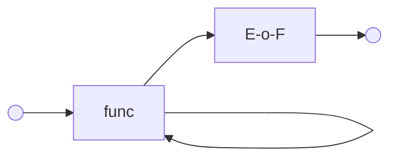

## Statements

### stmt
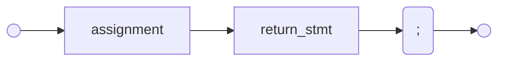

## Simple statements

### assignment
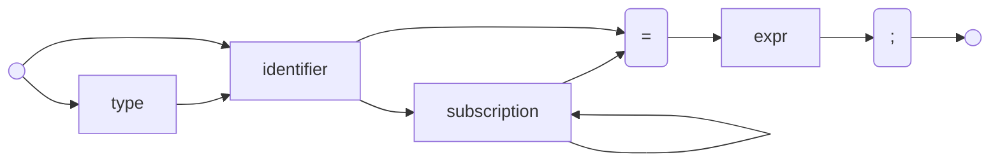

### return_stmt
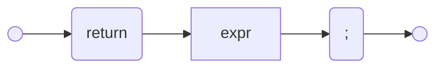

## Compund statements
Compound statements contain other statements.

### compound_stmt
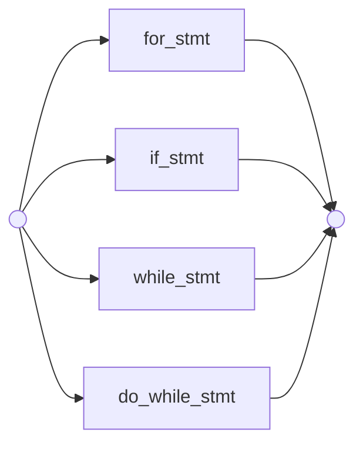

### if_stmt
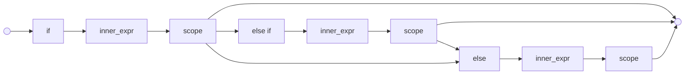

### scope
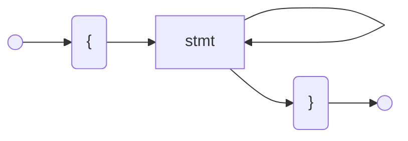

### for_stmt
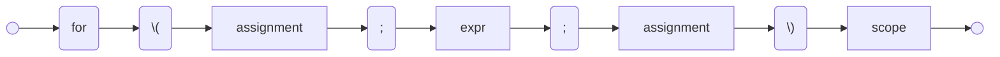

### while_stmt
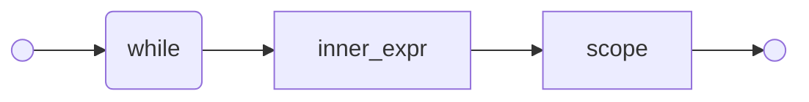

### do_while_stmt
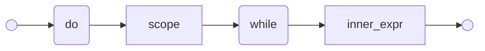

## Functions

### func
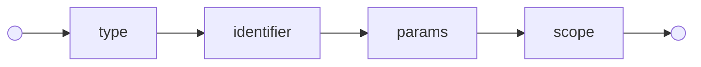

### params
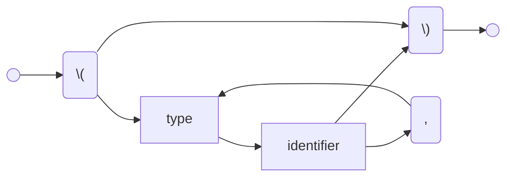

## Types
These are the built in types of the language.

### int8
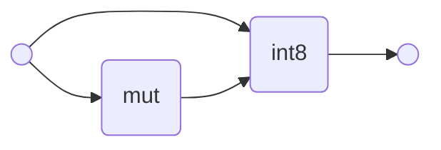

### int16


### int32
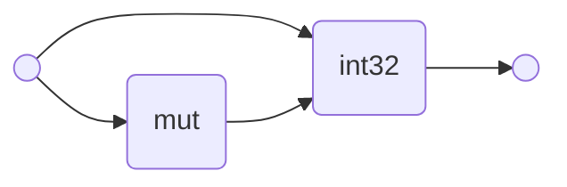

### int64


### uint8
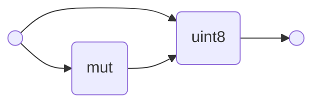

### uint16


### uint32


### int64
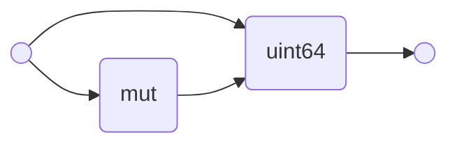

### float
```mermaid
graph LR
    start(( )) --> type(float) --> stop(( ))
    start --> mut(mut)
    mut --> type
```

### double
```mermaid
graph LR
    start(( )) --> type(double) --> stop(( ))
    start --> mut(mut)
    mut --> type
```

### string
```mermaid
graph LR
    start(( )) --> type(string) --> stop(( ))
    start --> mut(mut)
    mut --> type
```

### bool
```mermaid
graph LR
    start(( )) --> type(bool) --> stop(( ))
    start --> mut(mut)
    mut --> type
```

## Expressions
Expressions computes values. They are defined using many non-terminals in order
to control precedence.

### expr
```mermaid
graph LR;
    start(( )) --> and_test --> stop(( ))
    and_test --> or(or) --> and_test
```

### and_test
```mermaid
graph LR;
    start(( )) --> not_test --> stop(( ))
    not_test --> and(and) --> not_test
```

### not_test
```mermaid
graph LR;
    start(( )) --> not(not) --> comparison --> stop(( ))
    start --> comparison
```

### comparison
```mermaid
graph LR;
    start(( )) --> term --> stop(( ))
    term --> comp_opr
    --> term
```

### comp_opr
```mermaid
graph LR;
    start(( )) --> less_than(<) --> stop(( ))
    start --> greater_than(>) --> stop
    start --> equal(==) --> stop
    start --> less_equal(<=) --> stop
    start --> greater_equal(>=) --> stop
    start --> not_equal(!=) --> stop
```

### term
```mermaid
graph LR;
    start(( )) --> factor --> stop(( ))
    factor --> term_opr
    --> factor
```

### term_opr
```mermaid
graph LR;
    start(( )) --> plus(\+) --> stop(( ))
    start --> minus("-") --> stop
```

### factor
```mermaid
graph LR;
    start(( )) --> factor_prefix
    --> primary
    --> stop(( ))
    start --> primary
    --> factor_opr
    --> factor_prefix
```

### factor_prefix
```mermaid
graph LR;
    start(( )) --> plus(\+) --> stop(( ))
    start --> minus("-") --> stop
```

### factor_opr
```mermaid
graph LR;
    start(( )) --> multiply(\*) --> stop(( ))
    start --> divide(\/) --> stop
    start --> modulo(%) --> stop
    start --> floor_division(\/\/) --> stop
```

### primary
```mermaid
graph LR;
    start(( )) --> atom
    --> primary_suffix
    --> stop(( ))
    primary_suffix --> primary_suffix
    atom --> stop
```

### primary_suffix
```mermaid
graph LR;
    start(( )) --> arguments --> stop(( ))
    start --> subscription --> stop
```

### atom
```mermaid
graph LR;
    start(( )) --> identifier --> stop(( ))
    start --> integer_literal --> stop
    start --> float_literal --> stop
    start --> string_literal --> stop
    start --> boolean_literal --> stop
    start --> none_literal --> stop
    start --> inner_expr --> stop
    start --> list_display --> stop
    start --> dict_display --> stop
```

### inner_expr
```mermaid
graph LR;
    start(( )) --> left_bracket("\(") --> expr --> right_bracket("\)") -->
    stop(( ))
```

### list_display
```mermaid
graph LR;
    start(( )) --> left_bracket("\[")
    --> expr
    --> right_bracket("\]")
    --> stop(( ))
    expr --> comma(,)
    --> expr
    comma --> right_bracket
```

### dict_display
```mermaid
graph LR;
    start(( )) --> left_brace("{")
    --> string_literal
    --> colon(:)
    --> expr
    --> right_brace("}")
    left_brace --> right_brace
    expr --> comma(,)
    --> string_literal
    comma --> right_brace
```

### arguments
```mermaid
graph LR;
    start(( )) --> left_paren("\(")
    --> expr
    --> right_paren("\)")
    --> stop(( ))
    expr --> comma(,)
    comma --> expr
    comma --> right_paren
```

### subscription
```mermaid
graph LR;
    start(( )) --> left_bracket("\[") --> expr --> right_bracket("\]") -->
    stop(( ))
```

## Literals
Literals specifies values.

### integer_literal
```mermaid
graph LR;
    start(( )) --> integer_literal("(0|[1-9][0-9]*)") --> stop(( ))
```

### float_literal
```mermaid
graph LR;
    start(( )) --> float_literal("(0|[1-9][0-9]*)\.[0-9]*") --> stop(( ))
```

### string_literal
```mermaid
graph LR;
    start(( )) --> string_literal("\#34;(\\.|[^#34;\\])*\#34;") --> stop(( ))
```

### boolean_literal
```mermaid
graph LR;
    start(( )) --> true_literal(true) --> stop(( ))
    start(( )) --> false_literal(false) --> stop(( ))
```

### none_literal
```mermaid
graph LR;
    start(( )) --> none_literal(none) --> stop(( ))
```

## Identifier
Identifies functions and variables.

### identifier
```mermaid
graph LR
    start(( )) --> identifier("[_a-zA-Z][_a-zA-Z0-9]*") --> stop(( ))
```
